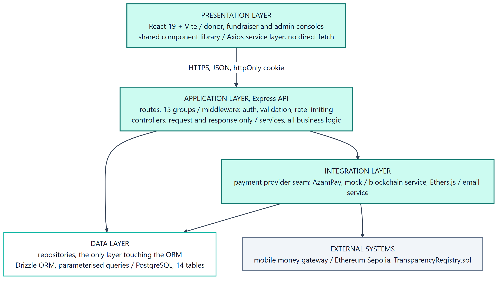
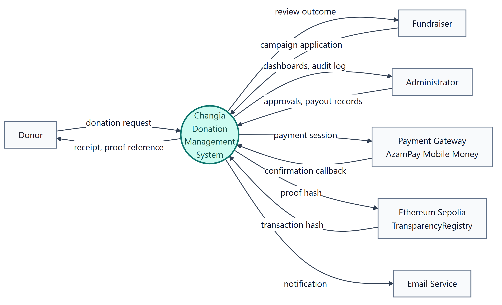
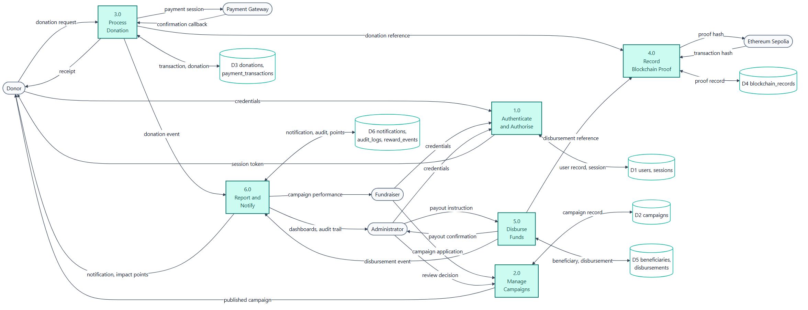
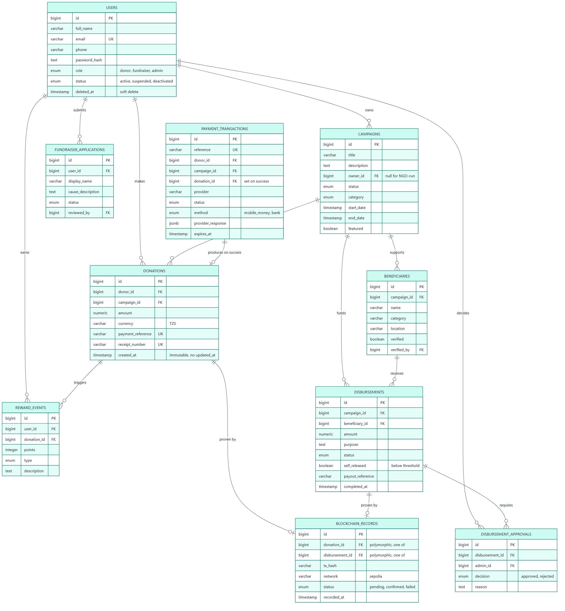
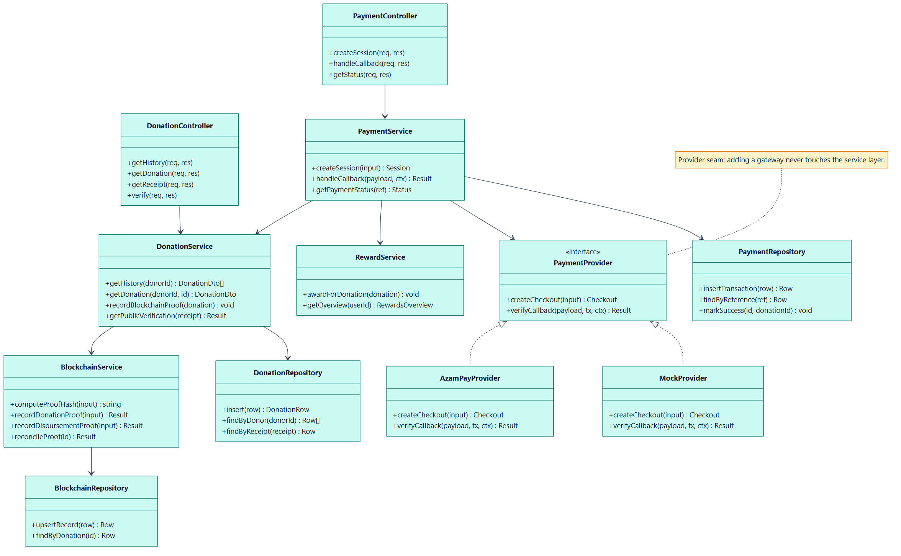
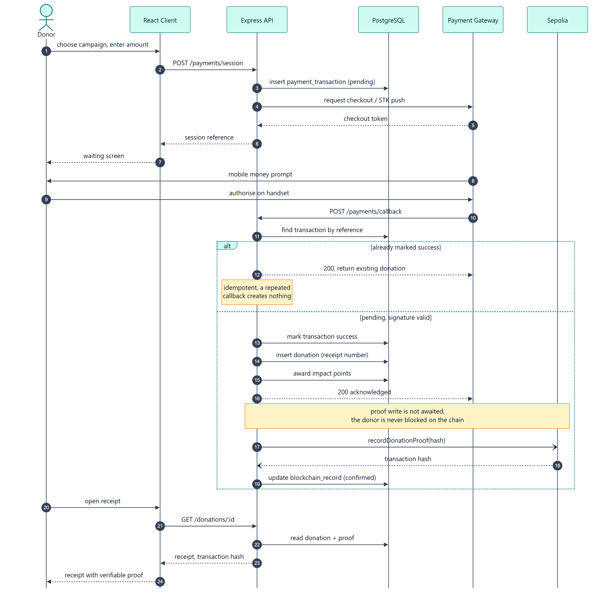
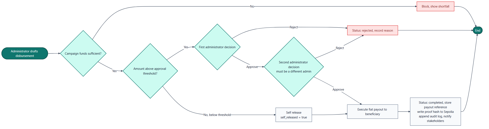
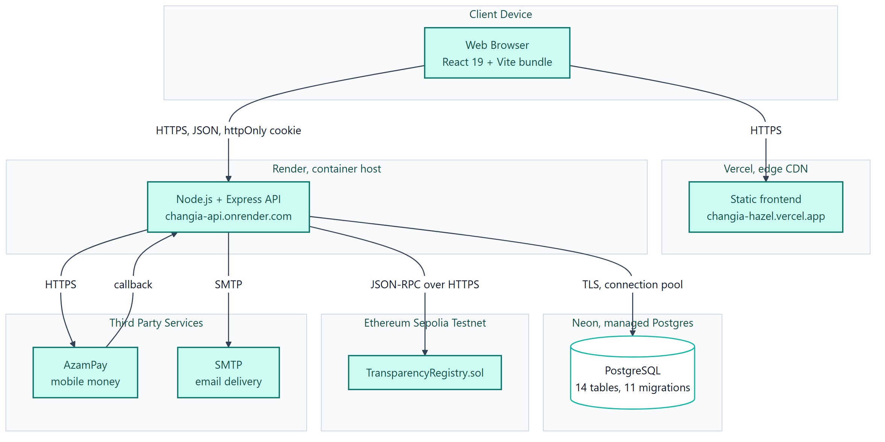

# CHAPTER SIX: SYSTEM DESIGN {-}

```{=latex}
\startchapter{6}
```

## 6.1 Introduction {-}

Chapter Five states what the system must do; this chapter explains how it is structured to do it. The design uses a layered web architecture, relational data model, Ethereum proof registry and documented process controls.

<!-- Framing: Chapter 5 = WHAT the system must do. Chapter 6 = HOW.
     Name the notations used: DFD, ERD, UML. -->

## 6.2 System Architecture {-}

The React client communicates with the Express API. Routes delegate to controllers, services and repositories; the repository layer persists operational state to PostgreSQL. Payment providers and Ethereum are external integrations behind service boundaries, ensuring that a provider or proof-write failure does not corrupt the completed donation record.

<!-- Source: docs/SYSTEM_ARCHITECTURE.md, BACKEND_ARCHITECTURE.md,
     FRONTEND_ARCHITECTURE.md. Layered: React/Vite client, Express API
     (routes to controllers to services to repositories), PostgreSQL on Neon,
     side rail for Sepolia and the payment provider. -->

{#fig:architecture width=100%}

## 6.3 Data Modeling {-}

### 6.3.1 Context Diagram {-}

{#fig:context width=100%}

### Data Flow Diagrams {-}

<!-- Present the context diagram first, then drill into Level 1. -->

{#fig:dfd1 width=100%}

## 6.4.1 Database Design {-}

The relational model holds users, sessions, password resets, campaigns, donations, payment transactions, beneficiaries, disbursements, approvals, blockchain records, notifications, audit logs, rewards and fundraiser applications. IDs are BIGINT values and money is stored in whole Tanzanian shillings. Donations, disbursements and blockchain records are immutable business records; mutable entities use controlled status changes or soft deletion.

<!-- Template has no parent 6.4. Mirrored deliberately, see D2.
     Source: database/DATABASE_SCHEMA.md, server/src/database/schema/*.ts.
     14 tables, 11 applied migrations, Drizzle ORM. -->

{#fig:erd width=100%}

<!-- Still to write: database schema listing, data dictionary, table
     structures. Data dictionary: donations table field by field. -->

## 6.5 Process Modeling {-}

### 6.5.1 UML Models {-}

<!-- Use case diagram and descriptions still to be authored. -->

{#fig:class width=100%}

{#fig:sequence width=100%}

{#fig:activity width=100%}

{#fig:deployment width=100%}

## 6.7 User Interface Design {-}

The public interface prioritises campaign discovery, understandable donation controls and proof lookup. Protected interfaces are role-specific: donors see history and receipts; fundraisers see their owned campaigns and permitted actions; administrators receive operational navigation, reviews, audit records and reports. Each page includes explicit loading, empty, error and success states.

<!-- Template skips 6.6. Mirrored deliberately, see D2.
     Source: pages/*.md, docs/DESIGN.md, docs/DESIGN_SYSTEM.md, live site.
     Cover: login screen, dashboard, forms, reports. -->

## 6.9 Machine Learning and Dataset Design {-}

The integrated risk module implements an explainable hybrid risk assessment. Rules produce human-readable signals while an Isolation Forest identifies unusual combinations of transaction features. The model is unsupervised because labelled fraud history is unavailable; it is only fitted after sufficient donation history and is re-fitted on a schedule. Reviews can later create the labels needed for supervised evaluation. The module is feature-flagged off by default, so it does not affect payment completion until the migration is applied and the flag is deliberately enabled.

<!-- 6.8 Hardware or Automation Design is omitted: not applicable, and the
     template says omit rather than leave placeholders.

     THIS SECTION IS DESIGN ONLY. Binding rule from SYNC S1: never imply a
     working model exists. Use the exact label "Designed, implementation
     scheduled". Cover dataset source (the platform's own donation and
     disbursement history), candidate features (amount anomaly, velocity,
     new-beneficiary risk, campaign age), model family, train/test split. -->

### 6.9.1 Algorithms of the Working System {-}

For a completed donation, the service combines donation identifier, campaign identifier, amount, receipt number, payment reference and timestamp into a SHA-256 proof hash. The database finalises the donation before attempting the chain write. For payouts, the service checks campaign ownership, verified beneficiary, available balance and threshold/initiator rules before completing a disbursement.

<!-- Template reuses 6.9 for this. Renumbered to 6.9.1 so the ToC stays
     valid, the only numbering fix permitted under D2.
     Source: docs/BUSINESS_RULES.md. Proof-hash algorithm as pseudocode,
     dual-approval threshold logic, reward point calculation. -->

## 6.10 Flowcharts of the Working System {-}

The payment workflow is: validate request; create provider session; verify callback; atomically create donation and payment completion; update campaign; schedule proof; notify donor. The disbursement workflow validates beneficiary and balance, then either completes under permitted rules or waits for a separate administrator decision.

<!-- Source: flows/payment-flow.md, disbursement-flow.md, blockchain-flow.md. -->

## 6.11 Security Design {-}

This design implements the Security NFR in Section 5.5 with bcrypt password hashing, short-lived JWT access tokens, rotating httpOnly refresh tokens, RBAC, account lockout, rate limits, validation, parameterised database access, audit logging and safe upload names. The proof registry stores hashes rather than donor data, and public verification omits donor identity and payment references.

<!-- Source: docs/SECURITY.md. JWT access plus rotating httpOnly refresh,
     bcrypt, RBAC, account lockout, rate limiting, parameterised queries,
     audit log, separation of duties.
     Traceability: reference the Security non-functional requirement from
     5.5 explicitly, the template asks for this. -->
